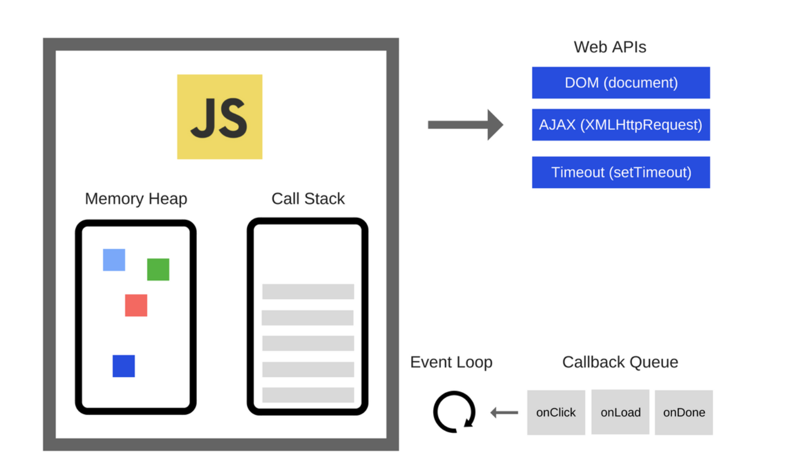

# JavaScript

### JavaScript

JavaScript is a high-level, interpreted programming language

###  JS event loop



​

The Event Loop has one simple job — to monitor the Call Stack and the Callback Queue. If the Call Stack is empty, it will take the first event from the queue and will push it to the Call Stack, which effectively runs it.S6 New Feature

### ES6

* Let Const
* Class
* Arrow Function
* Spread and Destructing
* Modules
* Promise
* Symbol

### Hoisting

Hoisting is a term used to explain the behavior of 'var ' declaration. When declared or initialized with the var keyword. var will move up to the top of the current scope

However, only the variable declarations and function declarations are hoisted. Variable assignments and function expressions are not hoisted. 

```javascript
console.log(myName);
var myName = "Mandy";
// out put undefined

var myName;
console.log(myName);
myName = "Mandy"

```

### Closure

A closure is inner function that has access to the variables in the outer function

```javascript
function init(){
 var name = "a";
 function b(){
 alter(name)
 }
 b();
 }
 
 init();
 
 
 
 function makeAdder(x) {
  return function(y) {
    return x + y;
  };
}

var add5 = makeAdder(5);
var add10 = makeAdder(10);

console.log(add5(2));  // 7
console.log(add10(2)); // 12
```

### Solve Closure issue

```javascript
for (var i = 0; i <= 5; i++){
    setTimeout(function timer(){
        console.log(i);
    }, i*1000);
}
setTimeout is ascy and after for loop finished well print 6, 6, 6, 
// solve 1. change to let
// solve 2. use closure
for (var i = 0; i <= 5; i++){
    (function(j){
        setTimeout(function timer(){
            console.log(i);
        }, j* 1000);
    })(i)
}
```

Callback Function

The callback function is a function passed into another function as argument, which is then invoked inside the outer function to complete an outer function

```javascript
function printString(string, callback){
    setTimeOut(
     () => {
      console.log(string)
      callback()
     }, 
     Math.floor(Math.random() * 100) + 1
    )
}
// print A B and C callback hell
function printAll(){
  printString("A", ()=>{
   printString("B", ()=>{
    printString("C", ()=>{})
   })
  })
}
```

### Callback Hell

Callback Hell is a problem caused by asynchronous AJAX call, Which means where are mutliple nested callback hell

### Promise

Promise is a function to solve the async issues.

it is must be one of these states

* Pending: initial state, not fulfilled or rejected
* fulfilled: operation completed successfully
* rejected: meaning that operation failed

a promise object will either successes or fail

promised all : return a single promise that resolves when all of the promise in argument have solved or when the outterable argument contains no promises


```javascript
function printString(string){
    return new Promise((resolve, reject)=>{
        setTimeout(
            () =>{
                console.log(string)
                resolve
            }, Math.floor(Math.random() * 100) + 1
        )
    })
}
function printAll(){
    printString("A")
    .then(() => printString("B"))
    .them(() => printString("C"))
}
printAll()

function asyncDouble(n){
    return new Promise((resolve, reject)=>{
        if (typeof n === "number"){
            resolve(n*2)
        } else {
            reject(new Error(n + "is not a number"))
        }
    })
}
asyncDouble(3)
.then(
    date =>console.log(data);
    error =>console.log(error);
    )
    
var promise1 = new Promise(function(resolve, reject) {
  setTimeout(function() {
    resolve('foo');
  }, 300);
});

promise1.then(function(value) {
  console.log(value);
  // expected output: "foo"
});

console.log(promise1);
// expected output: [object Promise]

//类似于new Promise((resolve, reject) => resolve(“hi”))

```


### How to use promise chain

```javascript
doSometing()
.then(result => doSomethingElse(result))
.then(newResult => doThirdThing(newResult))
.then(finalResult => {
    console.log(`Got the final result: ${finalResult}`)
})
.catch(failureCallback)
```

### How To Use promise ALL

```javascript
var p1 = Promise.resolve(3);
var p2 = 1337;
var p3 = new Promise((resolve, reject) => {
  setTimeout(() => {
    resolve("foo");
  }, 100);
}); 

Promise.all([p1, p2, p3]).then(values => { 
  console.log(values); // [3, 1337, "foo"] 
});
```

We can start operations in parallel and wait for them to finished 

```javascript
Promise.all([func1(), func2(), func3()])
.then(([result1, result2, result3]) => {/*use result1, res2, res3*/})
```

```javascript
[func1, func2, func3].reduce((p, f) => p.then(f), Promise.resolve())
.then(result3 => { /* use result3 */ });
// sequential composition can be done mor simply with await
let result;
for (const f of [func1, func2, func3]) {
  result = await f(result);
}
```

### Splice\(\)

Syntax: 

```text
var arrDeletedItems = array.splice(start[, deleteCount[, item1[, item
2[, ...]]]])
```

char.splice\(startIndex, removeItemsNums, insert items1, intert items2\)

### Ways to improve the website loading time

* improve your hosting plan
* understand http request and reduce the http request
* make images internet-friendly. compress your image, lazy loading content
* take advantage of caching: download to you hard drive once into cache, or temporary storage space. Those files are now store locally. 
* Uitilize CDNS and Remove Unused Script 

### Event Loop

JS is a single thread language and allow js to use promise and callback during the event loop, first function will be added to a call stack, when this function is settime out or this is a promise, it will be added to event queue, we will check the call stack whether empty or not, if it is empty, it will then add the event queue function to stack, and execute 

this has two kinds of event in event Queue, micro and macro micro is settimeout and setinterval, macro is new promise

微任务包括 `process.nextTick` ，`promise` ，`Object.observe` ，`MutationObserver`

宏任务包括 `script` ， `setTimeout` ，`setInterval` ，`setImmediate` ，`I/O` ，`UI rendering`

1. 执行同步代码，这属于宏任务
2. 执行栈为空，查询是否有微任务需要执行
3. 执行所有微任务
4. 必要的话渲染 UI
5. 然后开始下一轮 Event loop，执行宏任务中的异步代码

```javascript
Promise.resolve().then(() => {	console.log(3)})
.then(() => {	console.log(4)})console.log(5)

console.log('script start');
setTimeout(function() { console.log('setTimeout'); }, 0);
new Promise((resolve) => { console.log('Promise') resolve() }).then(function() { console.log('promise1'); }).then(function() { console.log('promise2'); });
console.log('script end'); 
// script start => Promise => script end => promise1 => promise2 => setTimeout
作者：yck 链接：https://juejin.im/post/5ba34e54e51d450e5162789b 来源：掘金 著作权归作者所有。商业转载请联系作者获得授权，非商业转载请注明出处。Prototypal inheritance VS Classical inheritance
```

classical inheritance: a description of the object to be created. Classes inherit from classes and create subclass relationships.

prototypal inheritance: a prototype is a working object instance. Objects inherit directly from other objects. 

```javascript
class vehicle { 
constructor(name, type){ 
this.name = name; this.type = type; }
 getName(){ return this.name; } 
 getType(){ return this.type; } 
 } 
 let car = new Vehicle("Tesla", "car");
 
 function Vehicle(name, type){
  this.name = name;
  this.type = type;
}

Vehicle.prototype.getName = function getName(){
  return this.name;
}

Vehicle.prototype.getType = function getType(){
  return this.type;
}

var car = new Vehicle("Tesla", "car"); 

//es5
function Vehicle (name, type) {
  this.name = name;
  this.type = type;
};
 
Vehicle.prototype.getName = function getName () {
  return this.name;
};
 
Vehicle.prototype.getType = function getType () {
  return this.type;
};
function Car (name) {
  Vehicle.call(this, name, ‘car’);
}
Car.prototype = Object.create(Vehicle.prototype);
Car.prototype.constructor = Car;
Car.parent = Vehicle.prototype;
Car.prototype.getName = function () {
  return 'It is a car: '+ this.name;
};
var car = new Car('Tesla');
console.log(car.getName()); // It is a car: Tesla
console.log(car.getType()); // car

/// es6
class Vehicle {
 
  constructor (name, type) {
    this.name = name;
    this.type = type;
  }
 
  getName () {
    return this.name;
  }
 
  getType () {
    return this.type;
  }
 
}
class Car extends Vehicle {
 
  constructor (name) {
    super(name, 'car');
  }
 
  getName () {
    return 'It is a car: ' + super.getName();
  }
 
}
let car = new Car('Tesla');
console.log(car.getName()); // It is a car: Tesla
console.log(car.getType()); // car


function Parent(name) {
    this.parent = name
}
Parent.prototype.say = function() {
    console.log(`${this.parent}: 你打篮球的样子像kunkun`)
}
function Child(name, parent) {
    // 将父类的构造函数绑定在子类上
    Parent.call(this, parent)
    this.child = name
}

/** 
 1. 这一步不用Child.prototype =Parent.prototype的原因是怕共享内存，修改父类原型对象就会影响子类
 2. 不用Child.prototype = new Parent()的原因是会调用2次父类的构造方法（另一次是call），会存在一份多余的父类实例属性
3. Object.create是创建了父类原型的副本，与父类原型完全隔离
*/
Child.prototype = Object.create(Parent.prototype);
Child.prototype.say = function() {
    console.log(`${this.parent}好，我是练习时长两年半的${this.child}`);
}

// 注意记得把子类的构造指向子类本身
Child.prototype.constructor = Child;

var parent = new Parent('father');
parent.say() // father: 你打篮球的样子像kunkun

var child = new Child('cxk', 'father');
child.say() // father好，我是练习时长两年半的cxk

作者：寻找海蓝96
链接：https://juejin.im/post/5d51e16d6fb9a06ae17d6bbc
来源：掘金
著作权归作者所有。商业转载请联系作者获得授权，非商业转载请注明出处。
```

```javascript
var obj = { a: 1 };
var copy = Object.assign({}, obj);
console.log(copy); // { a: 1 }
```

## Fetch 

A Fetch API provides a fetch method defined on a window object, which you can use to perform requests and sent it to the server. This method returns a Promise that you can use to retrieve the response of the request. 

### Map and forEach

forEach : parameter is function, change the original array and return it

Map: return a new array and original one is not modified 

### Why arrow function

run quickly and very clear concise syntax and more intuitive scope and no need to bind this

## `Call` vs `Apply`

Both are used to invoke functions and the first parameter will be used as the value of `this` within the function. However, `call` takes in comma-separated arguments as the next arguments while `apply` takes in an array of arguments as the next argumement

The **`apply()`** method calls a function with a given `this` value, and `arguments` provided as an array


```javascript
var array = ['a', 'b'];
var elements = [0, 1, 2];
array.push.apply(array, elements);
console.info(array); // ["a", "b", 0, 1, 2]

function Product(name, price) {
  this.name = name;
  this.price = price;
}

function Food(name, price) {
  Product.call(this, name, price);
  this.category = 'food';
}

function Toy(name, price) {
  Product.call(this, name, price);
  this.category = 'toy';
}

var cheese = new Food('feta', 5);
var fun = new Toy('robot', 40);

// implment call
function.prototype.call2 = function(content = window){
content.fn = this;
  let args = [...arguments].slice();
  let result = content.fn(..args);
  delete content;
  return result;
}
let foo = {
  value: 1
}
function bar(name, age){
  console.log(name);
  console.log(age);
  console.log(this.value);
}
bar.call2(foo, 'black', '18') // black 18 1

Function.prototype.apply2 = function(context = window) {
    context.fn = this
    let result;
    // 判断是否有第二个参数
    if(arguments[1]) {
        result = context.fn(...arguments[1])
    } else {
        result = context.fn()
    }
    delete context.fn
    return result
}

```

### Array.slice\(\) VS Array.splice\(\)

1. The splice\(\) method returns the removed item\(s\) in an array and slice\(\) method returns the selected element\(s\) in an array, as a new array object.
2. The splice\(\) method changes the original array and slice\(\) method doesn’t change the original array.
3. The splice\(\) method can take n number of arguments and slice\(\) method takes 2 arguments.


JavaScript中有三个可以对字符串编码的函数，分别是： escape,encodeURI,encodeURIComponent，相应3个解码函数：unescape,decodeURI,decodeURIComponent 。

### `TypeOf and InstanceOf` 

for typeOf javascript data structure

```javascript
typeof 1 // 'number'
typeof '1' // 'string'
typeof undefined // 'undefined'
typeof true // 'boolean'
typeof Symbol() // 'symbol'
typeof b // b 没有声明，但是还会显示 undefined
typeof [] // 'object'
typeof {} // 'object'
typeof console.log // 'function'

```

### **webpack**

At its core, **webpack** is a _static module bundler_ for modern JavaScript applications. When webpack processes your application, it internally builds a [dependency graph](https://webpack.js.org/concepts/dependency-graph/) which maps every module your project needs and generates one or more _bundles_.

### Debouncing

```javascript
function debounce(fn,wait=50,immediate) {
    let timer;
    return function() {
        if(immediate) {
            fn.apply(this,arguments)
        }
        if(timer) clearTimeout(timer)
        timer = setTimeout(()=> {
            fn.apply(this,arguments)
        },wait)
    }
    
function realFunc(){
    console.log("Success");
}

// 采用了防抖动
window.addEventListener('scroll',debounce(realFunc,500));
// 没采用防抖动
window.addEventListener('scroll',realFunc);

```

### implement Map forEach Reduce

```javascript
Array.prototype.myEach = function(callback){
    for (let i = 0; i < this.length; i++){
        callback(this[i], i, this);
    }
}

Array.prototype.myMap = function(callback){
    arr = [];
    for (let i = 0; i < this.length; i++){
        arr.push(callback(this[i], i, this))
    }
}

Array.prototype.myReduce = function(callback, initialVal){
    var accumular = (initialVal === undefined) undefined : initalVal;
    for (var i = 0; i < this.length; i++){
        if(accumulator !== undefined){
            accumlator = callback.call(undefined, accumulator, this[i], this);
        } else{
            accumulator = this[i];
        }
        return accumulator;
    }
}
```

### flatten nested array

```javascript
const data = [
  [1, 2, 3],
  [4, [5], 6],
  [7, 8, 9]
];

const flattenArray = data => {
  let res = [];
  data.forEach(ele => {
    if(Array.isArray(ele)){
      res.push(...flatten(ele));
    }else res.push(ele);
  }) 
}

const flattenArray = data => {
  return data.reduce((acc, cur) => {
    return acc.concat(
      Array.isArray(cur) ? flattenArray(cur) : cur;
    );
  }, []);
}

var arr = [1, [2, [3, 4]]];

function flatten(arr) {

    while (arr.some(item => Array.isArray(item))) {
        arr = [].concat(...arr);
    }

    return arr;
}

console.log(flatten(arr))
```

### flatten nested object

```javascript
function flattenObj(obj, parent, res = {}) {
  for (let key in obj) {
    let propName = parent ? parent + "." + key : key;
    if (typeof obj[key] == "object") {
      flattenObj(obj[key], propName, res);
    } else {
      res[propName] = obj[key];
    }
  }
  return res;
}

console.log(flattenObj(d));
```

### compare two object

```javascript
input: 
let a = {
  tagName: 'parent',
  textContent: 'haha',
  children: [
    {
      tagName: 'chilren',
      textContent: 'haha',
      children: null,
      className: 'nihaoa',
      id: '456'
    }
  ],
  className: 'nihao',
  id: '123'
};
let c = {
  tagName: 'parent',
  textContent: 'haha',
  children: [
    {
      tagName: 'chilren',
      textContent: 'haha',
      children: null,
      className: 'nihaoa',
      id: '456'
    }
  ],
  className: 'nihao',
  id: '123'
};

//answer
const compare = (a, b) => {
  for (const key in a) {
    if (Array.isArray(a[key]) && Array.isArray(b[key])) {
      for (let i = 0; i < a[key].length; i++) {
        if (compare(a[key][i], b[key][i]) === false) return false;
      }
    } else {
      if (a[key] !== b[key]) return false;
    }
  }
  return true;
};
```

## **remove the duplicate element in array**

```javascript
array.filter((item, index) =>{
  return array.indexOf(item) === index
});

//retrive duplicated values

array.filter((item, index) =>{
  return array.indexOf(item) !== index
});

array.reduce((unique, item) => {
  return unique.includes(item) ? unique : [...unique, item]
}, []);
```

## **return a promise and combine into a new object and add it into promise**

```javascript
const promise = (obj) => {
   return new Promise((resolve => {
     setTimeout(() => {
       resolve(obj);
     }, 0);
   }))
 }

 const wait = async () => {
   const val1 = await promise({a: 1});
   const val2 = await promise({b: 2});
   return await promise({...val1, ...val2});
 }

 wait().then((data) => {
   console.log(data);
 }) // {a: 1, b: 2}
```


### DeepCopy and shallowCopy

how to deepCopy and not change original data

* JOSN.parse\(JSON.stringify\(a\)\);
* Lodash

```javascript
var objects = [{ 'a': 1 }, { 'b': 2 }];
 
var deep = _.cloneDeep(objects);
console.log(deep[0] === objects[0]);
```

```javascript
function isObj(obj) {
    return (typeof obj === 'object' || typeof obj === 'function') && obj !== null
}

function deepCopy(obj, hash = new WeakMap()) {
    if(hash.has(obj)) return hash.get(obj)
    let cloneObj = Array.isArray(obj) ? [] : {}
    hash.set(obj, cloneObj)
    for (let key in obj) {
        cloneObj[key] = isObj(obj[key]) ? deepCopy(obj[key], hash) : obj[key];
    }
    return cloneObj
}

function deepCopy(obj){
    //判断是否是简单数据类型，
    if(typeof obj == "object"){
        //复杂数据类型
        var result = obj.constructor == Array ? [] : {};
        for(let i in obj){
            result[i] = typeof obj[i] == "object" ? deepCopy(obj[i]) : obj[i];
        }
    }else {
        //简单数据类型 直接 == 赋值
        var result = obj;
    }
    return result;
}


```

### javascript 上下文执行：

```javascript
function foo() {
    console.log(a);
    a = 1;
}

foo(); // ???

function bar() {
    a = 1;
    console.log(a);
}
bar(); // ???

AO = {
    arguments: {
        length: 0
    }
}

//没有 a 的值，然后就会到全局去找，全局也没有，所以会报错。

//当第二段执行 console 的时候，全局对象已经被赋予了 a 属性，这时候就可以从全局找到 a 的值，所以会打印 1。
// 注意 只有 在 var 的时候


function foo(){// 函数提升
    console.log("foo");
}
var foo;// 变量提升
console.log(foo);
foo = 1; console.log(foo);
VM1737:5 ƒ foo(){// 函数提升
    console.log("foo");
}
VM1737:6 1
```

```javascript
var obj = {
    value: 1
};
function foo(o) {
    o.value = 2;
    console.log(o.value); //2
}
foo(obj);
console.log(obj.value) // 2

var obj = {
    value: 1
};
function foo(o) {
    o = 2;
    console.log(o); //2
}
foo(obj);
console.log(obj.value) // 1


```

参数如果是基本类型是按值传递，如果是引用类型按共享传递。

但是因为拷贝副本也是一种值的拷贝，所以在高程中也直接认为是按值传递了。

### implement new 

```javascript
function objectFactory() {

    var obj = new Object(),

    Constructor = [].shift.call(arguments);

    obj.__proto__ = Constructor.prototype;

    var ret = Constructor.apply(obj, arguments);

    return typeof ret === 'object' ? ret : obj;

};
```

### Promise

```javascript
  // 判断变量否为function
  const isFunction = variable => typeof variable === 'function'
  // 定义Promise的三种状态常量
  const PENDING = 'PENDING'
  const FULFILLED = 'FULFILLED'
  const REJECTED = 'REJECTED'

  class MyPromise {
    constructor (handle) {
      if (!isFunction(handle)) {
        throw new Error('MyPromise must accept a function as a parameter')
      }
      // 添加状态
      this._status = PENDING
      // 添加状态
      this._value = undefined
      // 添加成功回调函数队列
      this._fulfilledQueues = []
      // 添加失败回调函数队列
      this._rejectedQueues = []
      // 执行handle
      try {
        handle(this._resolve.bind(this), this._reject.bind(this)) 
      } catch (err) {
        this._reject(err)
      }
    }
    // 添加resovle时执行的函数
    _resolve (val) {
      const run = () => {
        if (this._status !== PENDING) return
        // 依次执行成功队列中的函数，并清空队列
        const runFulfilled = (value) => {
          let cb;
          while (cb = this._fulfilledQueues.shift()) {
            cb(value)
          }
        }
        // 依次执行失败队列中的函数，并清空队列
        const runRejected = (error) => {
          let cb;
          while (cb = this._rejectedQueues.shift()) {
            cb(error)
          }
        }
        /* 如果resolve的参数为Promise对象，则必须等待该Promise对象状态改变后,
          当前Promsie的状态才会改变，且状态取决于参数Promsie对象的状态
        */
        if (val instanceof MyPromise) {
          val.then(value => {
            this._value = value
            this._status = FULFILLED
            runFulfilled(value)
          }, err => {
            this._value = err
            this._status = REJECTED
            runRejected(err)
          })
        } else {
          this._value = val
          this._status = FULFILLED
          runFulfilled(val)
        }
      }
      // 为了支持同步的Promise，这里采用异步调用
      setTimeout(run, 0)
    }
    // 添加reject时执行的函数
    _reject (err) { 
      if (this._status !== PENDING) return
      // 依次执行失败队列中的函数，并清空队列
      const run = () => {
        this._status = REJECTED
        this._value = err
        let cb;
        while (cb = this._rejectedQueues.shift()) {
          cb(err)
        }
      }
      // 为了支持同步的Promise，这里采用异步调用
      setTimeout(run, 0)
    }
    // 添加then方法
    then (onFulfilled, onRejected) {
      const { _value, _status } = this
      // 返回一个新的Promise对象
      return new MyPromise((onFulfilledNext, onRejectedNext) => {
        // 封装一个成功时执行的函数
        let fulfilled = value => {
          try {
            if (!isFunction(onFulfilled)) {
              onFulfilledNext(value)
            } else {
              let res =  onFulfilled(value);
              if (res instanceof MyPromise) {
                // 如果当前回调函数返回MyPromise对象，必须等待其状态改变后在执行下一个回调
                res.then(onFulfilledNext, onRejectedNext)
              } else {
                //否则会将返回结果直接作为参数，传入下一个then的回调函数，并立即执行下一个then的回调函数
                onFulfilledNext(res)
              }
            }
          } catch (err) {
            // 如果函数执行出错，新的Promise对象的状态为失败
            onRejectedNext(err)
          }
        }
        // 封装一个失败时执行的函数
        let rejected = error => {
          try {
            if (!isFunction(onRejected)) {
              onRejectedNext(error)
            } else {
                let res = onRejected(error);
                if (res instanceof MyPromise) {
                  // 如果当前回调函数返回MyPromise对象，必须等待其状态改变后在执行下一个回调
                  res.then(onFulfilledNext, onRejectedNext)
                } else {
                  //否则会将返回结果直接作为参数，传入下一个then的回调函数，并立即执行下一个then的回调函数
                  onFulfilledNext(res)
                }
            }
          } catch (err) {
            // 如果函数执行出错，新的Promise对象的状态为失败
            onRejectedNext(err)
          }
        }
        switch (_status) {
          // 当状态为pending时，将then方法回调函数加入执行队列等待执行
          case PENDING:
            this._fulfilledQueues.push(fulfilled)
            this._rejectedQueues.push(rejected)
            break
          // 当状态已经改变时，立即执行对应的回调函数
          case FULFILLED:
            fulfilled(_value)
            break
          case REJECTED:
            rejected(_value)
            break
        }
      })
    }
    // 添加catch方法
    catch (onRejected) {
      return this.then(undefined, onRejected)
    }
    // 添加静态resolve方法
    static resolve (value) {
      // 如果参数是MyPromise实例，直接返回这个实例
      if (value instanceof MyPromise) return value
      return new MyPromise(resolve => resolve(value))
    }
    // 添加静态reject方法
    static reject (value) {
      return new MyPromise((resolve ,reject) => reject(value))
    }
    // 添加静态all方法
    static all (list) {
      return new MyPromise((resolve, reject) => {
        /**
         * 返回值的集合
         */
        let values = []
        let count = 0
        for (let [i, p] of list.entries()) {
          // 数组参数如果不是MyPromise实例，先调用MyPromise.resolve
          this.resolve(p).then(res => {
            values[i] = res
            count++
            // 所有状态都变成fulfilled时返回的MyPromise状态就变成fulfilled
            if (count === list.length) resolve(values)
          }, err => {
            // 有一个被rejected时返回的MyPromise状态就变成rejected
            reject(err)
          })
        }
      })
    }
    // 添加静态race方法
    static race (list) {
      return new MyPromise((resolve, reject) => {
        for (let p of list) {
          // 只要有一个实例率先改变状态，新的MyPromise的状态就跟着改变
          this.resolve(p).then(res => {
            resolve(res)
          }, err => {
            reject(err)
          })
        }
      })
    }
    finally (cb) {
      return this.then(
        value  => MyPromise.resolve(cb()).then(() => value),
        reason => MyPromise.resolve(cb()).then(() => { throw reason })
      );
    }
  }

```


