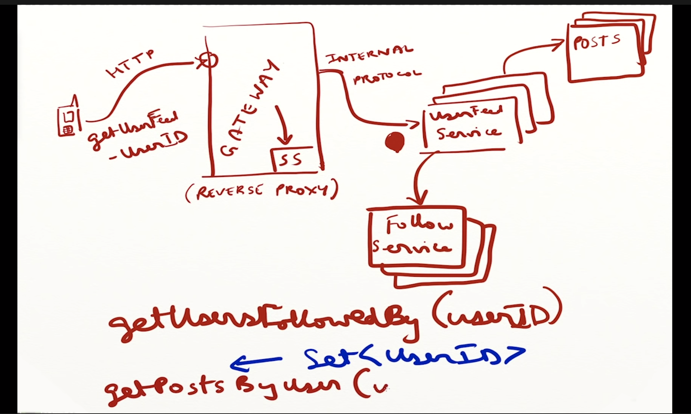
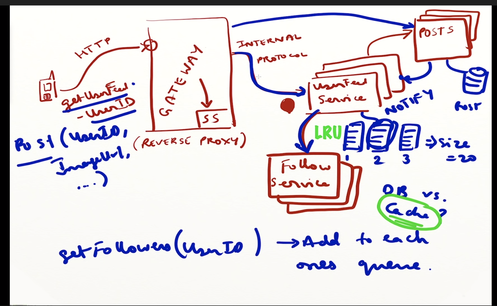
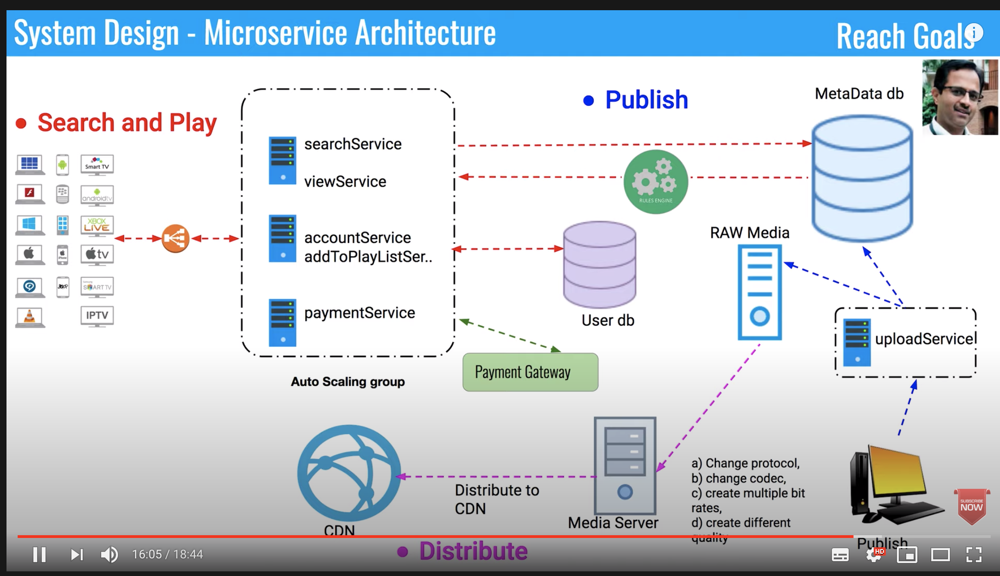

# System design

## instagram 

need a gateway server to deal with 

client use HTML protocol 

## 

How to reroute to different server side

1. profile

   create profile =&gt; gateway server \(use token, authocation \)-&gt; profile server \(create profile\) -&gt; create account 

 

1. store, share images

image -&gt; store in file system. separate store images url and image in storage \(cloud, distribute file system  \) and store url \(CDN\) 

1. more cheaper 2. faster 3. can use CDN
2. like, comment

use different table 

use active table to control different action

1. follow someone

   table : follow userid followed id 

1. publish news feed

many server : use load balance \(consistency hashing\)

client =&gt; news feed -&gt; post and follow 

notification =&gt; from follow 

long polling

clerebrity let user poll get new notify

1. message 

effect way is use peer to peer protocol tcp use connect id to connect with server to connect \(use session\)

## 2. youtube . spotify \(video\)

## Top K

{% embed url="https://www.evernote.com/shard/s440/client/snv?noteGuid=db5d1f47-fc86-4bed-3323-46a19a029216&noteKey=53aa5fffcc236d3b7ef209ef5d916639&sn=https%3A%2F%2Fwww.evernote.com%2Fshard%2Fs440%2Fsh%2Fdb5d1f47-fc86-4bed-3323-46a19a029216%2F53aa5fffcc236d3b7ef209ef5d916639&title=Design%2Ba%2Bsystems%2Bwhich%2Bfinds%2BTop%2BK%2528Heavy%2BHitters%2529" %}

  
p.p1 {margin: 0.0px 0.0px 0.0px 0.0px; font: 17.0px 'Helvetica Neue'}  
p.p2 {margin: 0.0px 0.0px 0.0px 0.0px; font: 12.0px 'Helvetica Neue'}  
p.p3 {margin: 0.0px 0.0px 0.0px 0.0px; font: 12.0px 'Helvetica Neue'; min-height: 14.0px}  
li.li2 {margin: 0.0px 0.0px 0.0px 0.0px; font: 12.0px 'Helvetica Neue'}  
ol.ol1 {list-style-type: decimal}  

**Cache**

1. Reduce network call
2. Reduce recomputation
3. Reduce DB load

Popular cache policy: LRU,  Sliding Window Cache policies

Cache can put close to server or db

Server with : fail it will be fill but it is easer

Global cache : \(redis \) manager data before query to db

Two ways : 1. Write through

                    2. Write back

You can do hybrid according to different kinds of data

Loader balance - web cache database consistency 

Before request send to server, use load balance to calculate it which server we need to request

Consistency hashing ——— like circle and clockwise. If serever fail or change change small

Message queue :

Get request , polling if server crash load balancing to assign different server 

. The short answer is: Scalability. The detailed one would be:

Advantages:

1\) The microservice architecture is easier to reason about/design for a complicated system.

2\) They allow new members to train for shorter periods and have less context before touching a system.

3\) Deployments are fluid and continuous for each service.

4\) They allow decoupling service logic on the basis of business responsibility

5\) They are more available as a single service having a bug does not bring down the entire system. This is called a single point of failure.

6\) Individual services can be written in different languages.

7\) The developer teams can talk to each other through API sheets instead of working on the same repository, which requires conflict resolution.

8\) New services can be tested easily and individually. The testing structure is close to unit testing compared to a monolith.

**Microservices are at a disadvantage to Monoliths in some cases. Monoliths are favorable when:**

1\) The technical/developer team is very small

2\) The service is simple to think of as a whole.

3\) The service requires very high efficiency, where network calls are avoided as much as possible.

4\) All developers must have context of all services.

No SQL or SQL

No SQL : JSON not care about schema is fixable and easy to change.

Not : not build for update, delete and add . Search not very easy read optimize 

No relationship in no sql database

Design ins:

Store/ get images

Like/ comment image

Follow 

Publish a new follow 

Tinder

