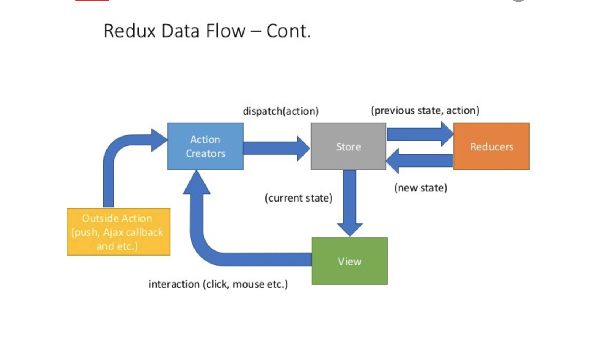

# Redux

### Redux

Redux is an open source library to manage application state. all state kept in a single store. This is easy to used with React Component 

### JSX

JSX is a syntax extension to JavaScript. It is similar to a template language, but it has full power of JavaScript. JSX gets compiled to `React.createElement()` calls which return plain JavaScript objects called “React elements”.

### Synthetic Event

Synthetic Event is a cross-browser wrapper around the browser's native event. It has the same interface as the browser's native event, including `stopPropagation()` and `preventDefault()`, except the events work identically across all browsers. 

### React data flow

1. The user clicks a button in the app and a component prop is called like a function
2. the coresponding container dispatches an action. This happened the prop is tied to an action dispatcher using **mapDispatchToprops** 
3. A reducer "hears actions and run a function which returns a new state with specific modifications
4. The container knows that state has changed and modifies a specific prop in component as result of mapStateToprops function
5. The component has a props has officially changed due to a new state being genegerated, so if state is responsibe for any UI, the user will see it change

### 3 Fundamentals

* **Single source of truth**-the state of you whole application is stored in an object tree within a single store
* **State is read-only**-the only way to change state is to create an action, an object describing what happened
* **changes are made with pure functions**-to specify how the state tree is transformed by actions, you write pure reducers

